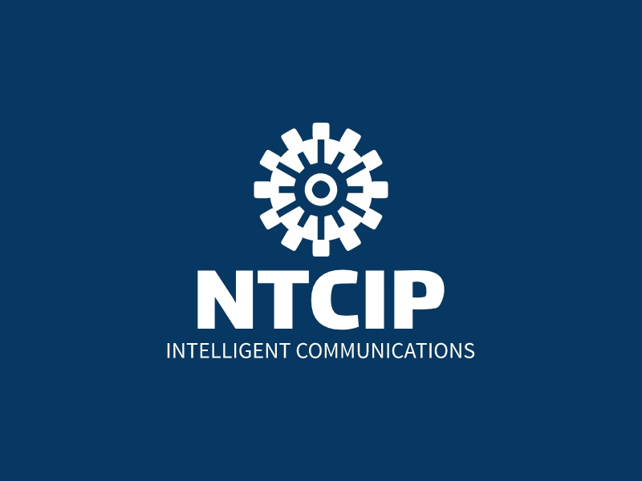

  
  <strong>Proposed Draft</strong>    
  <h1>Intelligent Transportation Systems (ITS) Open Source Development</h1>
  <strong>An open-source specification proposed for the NTCIP Joint Committee</strong>

---
## Accessing Released Versions 
This site is the open-souce development site for the ITS Open-Source Process. The most recent version of the document is available online at [https://k-vaughn.github.io/ITS-open-source/](https://k-vaughn.github.io/ITS-open-source/). Previously released versions are accessible from the [releases page](https://www.github.com/k-vaughn/ITS-open-source/releases).

## Project Summary

### Status

The project is currently a proposal and has not been reviewed by the broader NTCIP community. As such it is hosted at https://github.com/k-vaughn/ITS-open-source.

### Overview
This specification defines the process to be used to maintain open-source resources of the NTCIP Joint Committee. This specification is itself an open-source resource, which is maintained by the process defined by this specification. Anyone who wishes to contribute to or maintain an NTCIP open-source resource project should start by familiarizing themselves with the processes defined by this specification.

This specification is adapted from the [OpenSauced Introduction](https://github.com/open-sauced/intro) and tailored to meet the needs of the ITS community. While a product of NTCIP, it is envisioned to be used in open-source efforts beyond the NTCIP community and it can be further tailored to meet the needs of each ITS open-source resource project.

### Acknowledgements
This project is sponsored by the Base Standards and Profiles 2 Working Group (BSP2 WG) of the National Transportation Communications Interface Protocols (NTCIP) Joint Committee (JC), a joint standardization committee of the American Association of State Highway Transportation Officials (AASHTO), the Institute of Transportation Engineers (ITE), and the National Electrical Manufacturers Association (NEMA). It has benefited from funding from the US Department of Transportation (USDOT).

## 🤝 Open-Source Development

### Code of Conduct
When interacting with others in the development of this project, all participants are required to abide by the [Code of Conduct](CODE_OF_CONDUCT.md).

### Discussion Forum
If you have questions related to the project, we encourage you to visit our [GitHub Discussion]() forum. 

### Reporting Issues
Within traditional standards development processes, stakeholder concerns are reported as comments, primarily during defined stages of the project. Within an open-source environment, concerns are documented as issues and can be submitted at any time. 

All updates to the project are initiated by a stakeholder first reporting an issue. Issues can be as minor as reporting a typo or as major as suggesting a new section or complete rewrite of the document. If you have identified an issue, please submit it on our [Issues]() page.

When submitting an issue, the commenter is required to identify the type of issue and then provide specific information for that issue. Issue types that are applicable to this project include:

- **Bug report:** used to report an issue or inaccuracy in the documentation
- **Documentation enhancement:** used to suggest improvements to the project documentation
- **New requirement request:** used to propose a new requirement to be added to the documentation
- **Requirement modification request:** used to suggest a modification to an existing requirement

If you identify a security issue, please report it using our [security process](SECURITY.md).

As with comments in the traditional standards process, issues are reviewed and prioritized prior to being addressed. In the traditional process, the initial review is performed by the editor; within the open-source process, the review is performed by the maintainer. Depending on the impact of the issue, the maintainer can either prioritize the issue directly or might seek guidance from the working group.

Once an issue has been prioritized, it is made available for anyone in the open-source community to make a contribution to address the issue.

### Making Contributions
We encourage stakeholders to contribute to this project; however, contributions are required to abide by [the project rules](CONTRIBUTING.md) to ensure that the contributions follow the vision for the project, provide consistency in the final product, and are submitted with an understanding of legal permissions. 

## ⚖️ LICENSE

The license for this project is defined in the [license file](LICENSE), which references the . By providing a contribution to this project, contributors agree to submit their materials according to this license.
