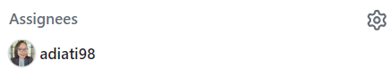
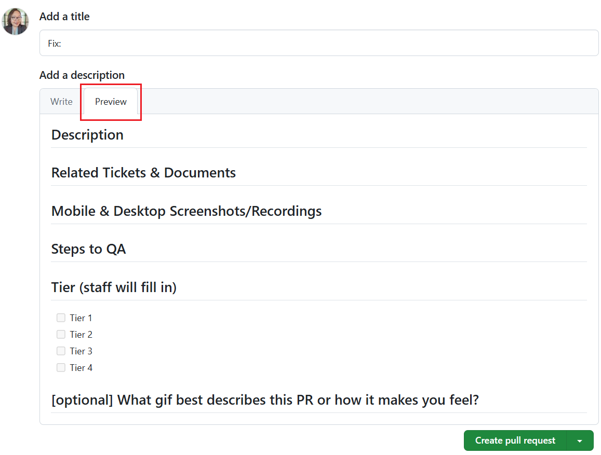
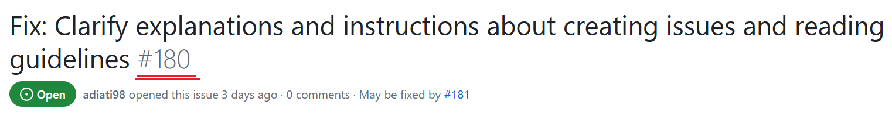

<style>
body {
  counter-set: section 4
}
</style>

# Contributor Responsibilities {.body}

## Overview {.body}

Contributions on projects using the ITS Open Source Process are always welcome, no matter how large or small. However, before contributing, it's important to familiarize yourself with the following resources of the project:

Some of this information is standardized in this document, but specific projects can extend or make exceptions to the process and will always have their own project-specific goals. Contributors are responsible for being familiar with the information contained in the following project files, as stored in the project's root directory:

- **README.md**: Provides an overview of the specific project, 
- **CODE_OF_CONDUCT.md**: Identifies the code of conduct for the project, and
- **CONTRIBUTING.md**: Identifies project-specific rules for contributing.  

For projects following the ITS Open-Source Process, the last two files will typically only identify exceptions or extensions to the rules defined by this document.

The overall process for contributing to an ITS open-source project is shown in Figure 4-1 and described in the remainder of this section. 


## Requirements {.body}

### Join the relevant working group {.body}

Those wishing to contribute **should** join the relevant working group.

!!! note
    Most projects using the ITS Open-Source Process are led by working groups (WGs) within standards development organizations (SDOs). The lead WG and SDO is typically identified within the README file in the root directory of the project repository. Contributors are strongly encouraged to join the corresponding working group to promote better communication among community members and to develop a common vision for the project.

!!! example
    The ITS Open-Source Process project is led by the Base Standards and Profiles 2 (BSP2) WG of the National Transportation Communications Interface Protocols (NTCIP) Joint Committee (JC).
    
!!! tip "NTCIP Guidance"
    Within the NTCIP, any interested party can send an email to ntcip@nema.org. The email should indicate (1) the working group of interest, (2) the stakeholder sector (e.g., infrastructure owner operator, other government, consultant, device manufacturer, management station developer, etc.), (3) contact information, and (4) a short biography.


### Install Git
Those wishing to contribute **shall** install Git on their local computer.

Those wishing to contribute **may** install a graphical user interface (GUI) for Git on their local computer.

!!! note
    Git is available for all major development platforms, including Windows, Mac OS, and Linux. Git allows proper version control among multiple contributors. Git can be downloaded from [https://git-scm.com/downloads](https://git-scm.com/downloads).

    Git natively uses a command line interface (CLI), which can be difficult for beginners. There are a variety of graphical user interfaces (GUIs) that are available to assist with interfacing with Git.
    
!!! example
    Example GUIs for beginners include:
    
    - [GitHub Desktop](https://desktop.github.com/download/): Very beginner level with minimal user interface
    - [SourceTree](https://www.sourcetreeapp.com): Beginner-friendly with support for advanced Git functionality
    - [GitKraken](https://www.gitkraken.com/git-client): Beginner-friendly with advanced options and modern UI with useful video clips to explain how to perform tasks.

!!! tip "NTCIP Guidance"
    While contributors are allowed to use the CLI or any GUI of their preference, this document references GitKraken videos due to (1) the user-friendly design of GitKraken, (2) the high-quality help (including videos) available for GitKraken. 

### Establish an Account on the Repository Hosting Platform
Those wishing to contribute **shall** fork the repository to their own account.

!!! note
    All edits are originate within the contributor's account and all contributions can be traced back to the contributor. 
    
!!! tip "NTCIP Guidance"
    Create an account on [GitHub](https://github.com). This requires a valid email address but is free for open-source work.

### Fork the repository {.body}
Those wishing to contribute **shall** fork the repository to their own account.

!!! note
    The main repository is shared by the entire open-source community on GitHub. Individual contributors are not allowed to directly edit this file as that would create a chaotic environment. Forking a repository creates a copy of the repository on the repository hosting platform within the contributor's account. The contributor can then edit the copied repository (as described below). The contributor's repository will inherit the visibility of the project being forked (i.e., for open-source projects, it will be public). This allows the open-source community to review the proposed changes prior to accepting their incorporation into the community repository.

!!! tip "Github Guidance"
   Press the "Fork" button in the upper-right portion of the shared repository's home page (e.g., https://github.com/<account>/<project>). For complate details, see the [Fork a Repository](https://docs.github.com/en/pull-requests/collaborating-with-pull-requests/working-with-forks/fork-a-repo) article on GitHub help.

### Clone the repository {.body}

The contributor **shall** clone (i.e., copy an instance of) the forked repository to the local machine where edits are to be made.

!!! note
    While a fork creates a copy on the host platform (which can be viewed by others), a clone creates a copy on a local machine. This allows the contributor to edit files on a local machine rather than directly in the online environment. 

!!! tip "GitKraken Guidance"
	- [GitKraken Guidance](https://help.gitkraken.com/gitkraken-desktop/open-clone-init/#cloning-an-existing-project)

### Claim an Issue {.body}

Before starting on any changes to the project, a contributor **shall** claim an associated issue.

A new contributor to a project **may** claim an issue tagged as [good first issue](https://github.com/open-sauced/intro/issues?q=is%3Aissue+is%3Aopen+label%3A%22good+first+issue%22), or [beginners only](https://github.com/open-sauced/intro/issues?q=is%3Aissue+is%3Aopen+label%3A%22beginners+only%22). 

Experienced contributors **shall not** claim issues tagged with the label "beginners only".

Experienced contributors **should** avoid issues tagged with the label "good first issue".

!!! note
    Taking ownership of an issue:

    - Notifies maintainers that work is starting to address the issue,
    - Allows efficient communication by allowing the maintainers and contributor to discuss the issue and proposed changes early in the update cycle,
    - Provides a historical record of the steps taken to address the issue,
    - Helps to block inappropriate pull requests as any pull request without an associated issue can be easily rejected. 

    When you're new to a project, it's a good idea to start with small, manageable tasks, fixing bugs, adding tests, or updating documentation. These will often be tagged with the text "good first issue" or "beginners-only". This will help you become familiar with the material and development workflow without getting overwhelmed.  The goal is to reserve at least some of these issues for new contributors or until the end of the project; if everyone solves these problems first, it makes it more challenging for contributors to gain experience.

!!! tip "GitHub Guidance"
    If an issue is not assigned, it is generally assumed to be available for anyone to work on. Take control of the issue by submitting a comment of `.take` on the selected issue). When an issue is assigned, it will be indicated under the "Assignees" section of the issue.

    

    > **NOTE:** Projects can implement additional rules regarding the assignment of issues. Always review the project's contributing guidelines to ensure you are aware of any variations from this standard process.

!!! tip
    If you get stuck while working on your changes or need other clarification, you can always ask for help using the discussions tab of the project. For example, you can get help for the ITS Open-Source Process project at the [Discussion Tab](https://github.com/ite-org/intro/discussions).


### Create a Branch {.body}

Prior to starting work on a claimed issue, the contributor **shall** create a separate branch for all edits related to that singlular issue.

!!! note
    Creating a separate branch facilitates tracking of changes and allows easier roll-backs of the project to known states.  

### Make Edits {.body}

Once the contributor has claimed an issue and has a branch devoted to the development of that issue, the contributor **shall** make changes in the local branch according to project guidelines.

!!! note
    Annex B, C, and D provide preferred guidelines that can be referenced for different types of contributions.

    If you have questions or concerns during the process (especially between meetings of the corresponding WG), you can use the Discussions tab associated with the project. These forums can be very useful in knowledge sharing and forming consensus, however, users should be aware that the discussions tab does not represent official decisions of the WG.


### Pull and Merge Updates {.body}

Prior to submitting a PR, the contributor **shall** pull the latest updates incorporated into the shared project and merge these updates into the contributor's working branch.

!!! note
    Because multiple contributors can be working on the same project simultaneously, care must be taken to ensure that each contributor has the latest version of files prior to proposing their changes to be incorporated into the shared repository. This is done by first pulling any changes from the shared repository into the contributor's forked version and then pulling those changes down into the contributor's local branch. During this process, the Git environment will highlight any conflicts (e.g., if the contributor and someone else changed the same line of the same file). When this occurs, the contributor will need to resolve each conflict prior to finalizing the merge.

### Test the Updates {.body}

After pulling and merging the latest updates but prior to submitting the PR, the contributor **shall** test the changes to ensure intended intended operation without any new bugs.

!!! note
    It is critical that updates are tested prior to being incorporated into the final code (this includes ensuring that documentation files render correctly). Specific projects can define their own testing process and procedures.

### Commit the Update {.body}

Prior to pushing the proposed changes to online repository, the contributor **shall** commit the changes in the working directory.

The contributor **may** perform interim commits during the development of the proposed changes. 

!!! note
    Committing changes ensures that the changes are logged in the contributor's local git account and is required prior to pushing the material to the contributor's online copy.

### Push the Update to Contributor's Online Repository {.body}

Once the contributor has completed the proposed revisions and has created a local commit, the contributor **shall** push the proposed changes to the contriutor's online repository.

!!! note
    The changes need to be posted to the online repository so that other users can review the changes prior to their incorporation into the shared repository.

### Make Pull Request {.body}

Once the contributor has completed the above steps, the contributor **shall** complete a pull request.

The contributor's pull request **shall** comply with the selected pull request template for the project.

!!! note
    In order to ensure that changes made to the shared repository fit with the project plan, follow subittal guidelines, and are free of bugs, it is important that they are reviewed before being incorporated. As such, rather than allowing each contributor to push changes to the shared repository without any review, they **request** the maintainer to **pull** the proposed changes. The request initiates the review process, and if successful, the changes will be pulled. The request for the maintainers to pull the updates is called a "pull request" (PR). In order to ensure that these requests are valid and useful, they must comply with the pull request template (e.g., identify the issue that the change claims to address).

### Cooperate with Reviewers {.body}

The contributor **shall** work with the review team to address any questions, concerns, or problems that arise.

The contributor **may** appeal any direction received from the reviewers to the parent WG. 

The contributor **shall** accept the direction of the review process, including any appeals.

!!! note
    After a pull request has been submitted, reviewers can have questions or concerns (e.g., failure to comply with style guidelines). In addition, if multiple proposals are received in a short period, last minute changes can cause merge errors that need to be resolved. The contributor is typically the person most qualified to make revisions to the proposed changes without introducing errors. Although expected to be rare, there can be instances where the contributor and reviewers have different opinions about how a change should be implemented. The shared project is managed by the entire team and the contributor needs to respect the decisions made by the full team.

## Process Details {.body}

### Claim an Issue
## Contribution Workflow {.body}

Once a maintainer has assigned you an issue, the next step is to work on the changes. Here's a general workflow of the process:

### 1. REQ-7: Fork the Repository {.body}

**REQ-7:** Start by forking the project repository

[Forking a repository](https://docs.github.com/en/get-started/quickstart/fork-a-repo#forking-a-repository) means creating a copy of the repository under your GitHub account. It allows you to push changes to the remote codebase without affecting the original project.

> **NOTE:** Steps 2-7 are defined as optional because there is no verification to ensure that they are performed in this manner; but in practice, they should always be performed as described.
 
### 2. OPT-8: Clone the Forked Repository {.body}

[Cloning your forked repository](https://docs.github.com/en/repositories/creating-and-managing-repositories/cloning-a-repository#cloning-a-repository) means making a copy of your forked repository to your local machine. Although GitHub allows editiing files through the web interface, it is generally easier to work on your local machine and you may be required to have the codebase on your local machine to verify its operation. 

Run the following command in your terminal:

```bash
git clone https://github.com/YOUR-USERNAME/REPOSITORY-NAME.git
```

Replace "YOUR-USERNAME" with your GitHub username and "REPOSITORY-NAME" with the repository's name.

**TODO:** Add explanation of how to do this with SourceTree

### 3. OPT-9: Create a New Branch {.body}

Before making any changes, create a new branch in your local repository to work on your contribution. Creating a new branch is the best practice in open source because it keeps your changes separate from the `main` branch.

You can create a new branch using the following command:

```bash
git checkout -b YOUR-BRANCH-NAME
```

Replace "YOUR-BRANCH-NAME" with a descriptive name for your branch, such as "fix-bug-123" or "add-new-feature".

**TODO:** Add explanation of how to do this with SourceTree


### 4. OPT-10: Run the Project {.body}
Install the dependencies and run the project. You need to be able to verify that the project performs properly after changes are made. It is a best practice to verify that your local environment is working properly at the start of your edits so that you can have confidence that any problem identified later was due to a change you made rather than due to some other environmental problem. 

### 5. OPT-11: Make Changes on a Single Issue {.body}

Now that you have a new branch, you can make changes to the codebase. Always follow the project's coding guidelines and conventions.

Ensure that you only address a single issue within this branch. 

If you work on multiple issues, work on them in separate branches and submit them separately to the project.

### 6. OPT-12: Run the Changes Locally {.body}

You should always run and check your changes in your local environment, regardless of how small they are. This is important to ensure they work as expected and won't break production.

You can find the instructions on how to run a project locally in the README file or in the contributing guidelines.

### 7. OPT-13: Commit the Changes {.body}

Once you've made your changes, add your changes to the staging area and commit them to your local repository with these commands:

```bash
git add .
git commit -m "Your commit message"
```

Replace `"Your commit message"` with a brief description of your changes.

**TODO:** Add explanation of how to do this with SourceTree

### 8. OPT-14: Push the Changes to Your Fork {.body}

Push your changes to your forked repository on GitHub by running the following command:

```bash
git push origin YOUR-BRANCH-NAME
```

Replace "YOUR-BRANCH-NAME" with the name of your branch.

**TODO:** Add explanation of how to do this with SourceTree

### 9. REQ-15: Submit a Pull Request {.body}

> **NOTE:** Within the Git environment, changes can be "pushed" (e.g., a command on my local machine to copy the changes on my local repository to my GitHub repository) or "pulled" (e.g., a command on my local machine to copy changes that were made on my Github respository to my local repository). However, if every contributor pushed their changes onto the shared respository, there would be chaos. Instead, when their code is ready, contributors submit a **request** to the maintainers of the shared repository to initiate a **pull**. This type of request is called a "pull request" or "PR". 

#### Create a Pull Request {.body}

Once you've pushed your changes to your GitHub account, you can now [create a pull request](https://docs.github.com/en/pull-requests/collaborating-with-pull-requests/proposing-changes-to-your-work-with-pull-requests/creating-a-pull-request-from-a-fork). To create a pull request:

1. Navigate to the original project's repository on GitHub.
2. Click the "Compare & pull request" button.
3. Fill in all required information in the template.
4. Click the "Create pull request" button.

#### Fill In a Pull Request Template {.body}

Most projects provided a pull request template that is shown and needs to be filled in Markdown. This template guides you in providing all the information maintainers need to review your pull request.

##### Tips to Fill In a Pull Request Template {.body}

It can be challenging to read and fill in a pull request template. Here is some tips on how to fill one:

1. **Preview Mode**

   Click the "Preview" tab to see the sections you must fill in before you do so. It will be easier for you to notice them in this mode, but note that you cannot edit them in preview mode.

   Here is an example of a pull request template in preview mode:

   

2. **Headings**

   Get back to the writing mode by clicking the "Write" tab. Pay attention to the headings with `#` symbols. You need to provide information right under these headings.

3. **Comments**

   The instructions on what information you must provide are usually written in the comments under each heading. You need to read and follow all instructions thoroughly.

   :::tip

   When filling in the information, write it below the comment so you can still see and follow the instructions.

   :::

   Here is the template in Markdown. Now, pay attention to the headings and the comments as we discussed:

   ```markdown
   ## Description

   <!--
   Please do not leave this blank
   This PR [adds/removes/fixes/replaces] the [feature/bug/etc].
   -->

   ## Related Tickets & Documents

   <!--
   Please use this format to link issue numbers: Fixes #123
   Specific keywords are defined at:
   https://docs.github.com/en/free-pro-team@latest/github/managing-your-work-on-github/linking-a-pull-request-to-an-issue#linking-a-pull-request-to-an-issue-using-a-keyword
   -->

   ## Mobile & Desktop Screenshots/Recordings

   <!-- Visual changes require screenshots -->

   ## Steps to QA

   <!--
   Please provide some steps for the reviewer to test your change. If   you have wrote tests, you can mention that here instead.

   1. Click a link
   2. Do this thing
   3. Validate you see the thing working
   -->

   ## Tier (staff will fill in)

   - [ ] Tier 1
   - [ ] Tier 2
   - [ ] Tier 3
   - [ ] Tier 4

   ## [optional] What gif best describes this PR or how it makes you feel?

   <!-- note: PRs with deleted sections will be marked invalid -->

   <!--
   For Work In Progress Pull Requests, please use the Draft PR feature,
   see https://github.blog/2019-02-14-introducing-draft-pull-requests/ for further details.

     For a timely review/response, please avoid force-pushing additional
     commits if your PR already received reviews or comments.

     Before submitting a Pull Request, please ensure you've done the following:
     - 📖 Read the project's CONTRIBUTING file
     - 📖 Read the project's CODE_OF_CONDUCT file
     - 👷‍♀️ Create small PRs. In most cases, this will be possible.
     - ✅ Provide tests for your changes.
     - 📝 Use descriptive commit messages.
     - 📗 Update any related documentation and include any relevant screenshots.
   -->
   ```

4. **Don't skip and delete anything in the template**

   What's important is that you must fill in every section in the template that doesn't say "optional" or doesn't mean for the core team or staff to fill in. Also, you must never delete or modify the template, even if you think a section doesn't apply to your contribution.

   If a section is irrelevant to your changes, leave a comment explaining why it's irrelevant or provide a brief "N/A" response. If you still need help with what to fill in, look at the previous pull requests and see how other contributors have done that.

##### Required Information to Provide in Most Pull Request Templates {.body}

Every project is unique. Each has its own pull request template structure and requires specific information to be provided. However, all projects typically require the following:

- **Title**

  Add a short and clear title that describes the change that you make. For example, "Fix: Color contrast in the landing page".

- **Description**

  Explain your changes in as much detail as possible. What did you fix? How did you fix it? Did you add a new function or modify a function? If there are several changes, consider using bullet points and providing links to the resources you use to back up your changes.

  Here is an example:

  ```markdown
  ## Description

  <!--
   Please do not leave this blank
   This PR [adds/removes/fixes/replaces] the [feature/bug/etc].
   -->

  This PR fixes the long repos' names that are partially stacked at the back of another name in the search input of the Explore tab.

  The changes made here:

  - Add Tailwind className:

    - [`truncate`](https://tailwindcss.com/docs/text-overflow#truncate) to truncate overflowing text.
    - [`tracking-tighter`](https://tailwindcss.com/docs/letter-spacing) to reduce letter spacing for better space.
    - `inline-block` to the `<span>` .

  - Remove Tailwind classNames:

    - `overflow-hidden` as it's [included in the `truncate`](https://tailwindcss.com/docs/text-overflow).
    - `break-all` as we don't want to add line breaks.
  ```

- **Related issue(s)**

  Most projects don't receive unsolicited pull requests (pull requests that are not accompanied by an issue). One reason is to avoid spam pull requests that might introduce irrelevant, low-quality, or harmful changes to the project's codebase.

  So, when you create a pull request, you want to include the related issue number. Add the keyword "Closes," "Fixes," or "Resolves" in front of the issue number, for example, "Closes #123".

  [Linking a pull request](https://docs.github.com/en/issues/tracking-your-work-with-issues/linking-a-pull-request-to-an-issue) to an issue will automatically close the issue once the pull request gets merged.

  You can find the issue number right after the title, as shown below.

  

  :::info

  Only add the [supported keyword](https://docs.github.com/en/free-pro-team@latest/github/managing-your-work-on-github/linking-a-pull-request-to-an-issue#linking-a-pull-request-to-an-issue-using-a-keyword) and the issue number here. Adding more words will prevent the issue from being closed automatically.

  :::

- **Screenshots or screen recordings**

  If your changes relate to UI improvement, consider adding screenshots or screen recordings to show the before-and-after changes.
  
#### Ensure that all checks passed {.body}
If you see any GitHub action bots or checks that failed after you submit your PR template, you need to read each one and understand why it failed. Then, you must address and fix it until all of them pass.

#### Do Not Message Maintainers or Tag Them in Comments {.body}
Maintainers are always notified whenever there is an incoming PR; there is no need to send them a direct message (DM). If you haven't received a review after one week, you may tag them in the PR comments to ask for an estimated review time.

#### Keep your branch up to date {.body}
Keep your branch up to date while waiting for review and resolve any merge conflicts in your terminal.

### 10. REQ-16 Respond to Any Feedback {.body}

After submitting your pull request, the project maintainers may provide feedback or request changes. Be sure to respond promptly and address any concerns or suggestions they may have.

By following these steps, you'll be able to submit your contributions to open source projects and collaborate with other developers to improve the codebase.


>⚠️ NOTE: A PR may be marked as invalid and closed if:
>
> - the issue is not assigned to the contributor who opened the PR.
> - no issue is linked to the PR.
> - PR template is incomplete, or any section in the template is deleted.
> - changes are made directly in the default (`main`) branch.

## What Happens Next? {.body}

After your contribution has been submitted and reviewed, one of the following outcomes may occur:

1. **Your contribution is accepted**: If your contribution is approved by the project maintainers, it will be merged into the main branch of the codebase. <br/>
   Congratulations! Your work is now part of the project, and you've made a valuable contribution to the open source community.

2. **Your contribution requires changes**: Sometimes, the project maintainers may request changes to your contribution before it can be accepted. This could be due to coding issues, conflicts with other changes, or a need for additional documentation. In this case, make the requested changes and resubmit your pull request.

3. **Your contribution is rejected**: In some cases, your contribution may not align with the project's goals or requirements, or it may not be the best solution to a problem. If your contribution is rejected, don't be discouraged. Take the feedback you received as an opportunity to learn and improve. You can always try contributing to another project or submitting a different contribution to the same project.

## Keeping Branches Up to Date {.body}

It is highly recommended that you update your remote and local branches habitually. That way, your branch will have the latest update when merged into the `main` branch of the original (`upstream`) repository.

The best times to update your branches are before you push your changes to the remote repository and while you're waiting for your pull request to be reviewed.

In general, it is preferrable to make small incremental changes to the project and to provide the updated materials as soon as possible after taking control of an issue. The longer the duration between checking out the project and submitting a pull request the higher the chance that another contributor will make competing changes in one of your files, which may need to be manually inspected to properly merge the changes.

### Updating Branches {.body}

#### Update your fork {.body}
To update your copy of the project, you first need to update your forked (`origin`) repository:

1. Go to your forked repository on GitHub.
2. Click the "Sync fork" button.
3. Click the green "Update branch" button.

#### Update your local copy {.body}
Then, pull the latest changes in the `main` branch in the `origin` repository to update your local working branch by following these steps in your terminal:

1. Go to your working branch.

   ```bash
   git checkout YOUR-BRANCH-NAME
   ```

2. Pull the latest changes with this command:

   ```bash
   git pull origin main
   ```

## Merge Conflicts {.body}

Merge conflicts are something you'll commonly encounter when contributing to an open source project. When two branches have made different changes to the same line(s) in the same file(s), Git cannot automatically determine which change to keep, resulting in a conflict.

When a merge conflict occurs, Git adds conflict markers (`<<<<<<<`, `=======`, and `>>>>>>`) to indicate the conflicting lines from different branches. Everything between the `<<<<<<<` and `=======` is the changes that you worked on (current changes). And everything between the `=======` to `>>>>>>>` is the incoming changes from the remote `main` branch.

You need to pay attention to the conflicts and decide how you want to resolve them. You can keep only your change, incoming change, or both changes.

### Tips to Prevent Resolving Merge Conflicts Repeatedly {.body}

Some open source repositories, such as OpenSauced's [guestbook](https://github.com/open-sauced/guestbook) and [pizza-verse](https://github.com/open-sauced/pizza-verse) repositories, have high contribution activities in the same files that can cause merge conflicts.

Below are some tips to prevent you from resolving merge conflicts repeatedly when contributing to open source projects:

#### 1. Following Instructions {.body}

Ensure you follow the instructions in the project's README or Contributing Guide, and don't miss any step.

#### 2. Pull Request Form {.body}

Complete the template form and fill in all areas when creating a pull request.

#### 3. Resolving Merge Conflicts Immediately {.body}

If a branch has merge conflicts that must be resolved, the merge button is automatically disabled. So, maintainers are not able to merge the pull request.

When you notice merge conflicts in your pull request or if a maintainer asks you to resolve merge conflicts, fix them immediately. The sooner you resolve the conflicts, the sooner maintainers can review and merge your pull request.

### Merge Conflicts in the Guestbook Repository {.body}

Since the primary purpose of the OpenSauced guestbook is to add your name to `.all-contributorsrc` and the `README.md` files, there is a high chance that you will encounter merge conflicts.

The conflicts happen when maintainers have merged pull requests before yours while you're working on your changes or waiting for your pull request to be reviewed. And you need to resolve them before your pull request can be merged.

#### Resolving Merge Conflicts {.body}

Before resolving merge conflicts, you must first [update your branches](#updating-branches). Then, follow these steps:

1. In the `.all-contributorsrc` file:

   - Click the "Accept Both Change" option on the top of your workspace in VS Code.
   - Move your profile details to the end of the contributors' array and fix anything necessary.

2. In the `README.md` file:

   - Click the "Accept Incoming Change" option on the top of your workspace in VS Code for each conflict in this file.

3. Run `npm run contributors:generate`.

   You will now see that the all contributors badge has been incremented, and your profile is generated at the end of the contributors' list in the `README.md` file.

4. Add and commit your changes.

   ```bash
   git commit -am "Resolve merge conflicts"
   ```

5. Push your commits to your remote branch.

   ```bash
   git push
   ```

<hr/>

As you continue to contribute to open source projects, you'll gain valuable experience, develop new skills, and build a strong portfolio of work. 
