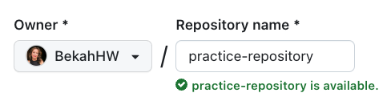

<style>
body {
  counter-set: section 3; 
}
</style>

# Documentation Conventions {.annex}

## Exceptions Allowed
Unless otherwise stated in the project-specific CONTRIBUTIONS.md file, each project based on this specification **shall** develop documentation as defined by this annex.

## Development Environment

### Overview

In addition to the development tools needed to manage and submit any contribution within the Git environment, developing project documentation requires the following tools

- **A text editor,** which is used to create and edit markdwon and yaml files. Markdown is a format used to define webpage content in a manner that is compatible with differencing tools used with version control systems
- **MkDocs,** which is an open source tool for translating a set of markdown files into a static website 
- **Materials for MkDocs,** which is an open-source tool that extends the markdown language to support additional features that are useful for developing the look and feel of the documentation.

This combination of tools has been selected because it:
- is designed to be easy to install and use, 
- requires minimal setup,
- works well with Git and GitHub,
- supports search functionality,
- can produce a static website,
- when coupled with add-ons, can produce PDFs
- has an active development community

It is recommended to establish this development environment prior to making any edits. Generating the documentation website locally from a known baseline allows the contributor to verify that the development environment is working correctly prior to introducing edits to the files. Contributors are required to generating the documentation locally to verify that their proposed changes do not introduce any errors to the project. In fact, the MkDocs development environemnt allows users to see their changes in real time so that any errors can be addressed quickly.

### Text Editor
Any text editor can be used to produce markdown and yaml files. These files are to have the extensions of ".md" and ".yml", respectively.

Suggested tools include: [^identify tools]

### MkDocs {.annex}
It is recommended that the MkDocs development environment is established prior to developing the content. 
 
Running the project locally allows the contributor to see proposed changes in real-time and test them thoroughly prior to submitting pull requests. The process to install Docusaurus is described below.

1. **Install the dependencies and run the project locally**.

The environment requires Node.js. You can check to see if you have Node.js already installed by running the following from the command line.

   ```bash
   node -v
   ```
If Node.js is not already on your machine, you can obtain it from their [website](https://nodejs.org/).


Once Node.js is installed, you can follow the directions on the [Introduction page of the Docusaurus site](https://docusaurus.io/docs)

   ```bash
   npm ci
   npm start
   ```

   After the local development server is ready, it will automatically open the project at `http://localhost:3000/learn` on your browser.

2. **Make and test changes**.

   With the local server running, you can make changes to the files and immediately see the results in your browser. Test your changes thoroughly.

3. **Stop the server**.

   After completing and testing the changes, you can stop the local server by pressing `Ctrl + C` in the terminal.

## Working with the Content {.annex}

The contents of our courses are written in [Markdown](https://www.markdownguide.org/), a lightweight and easy-to-use markup language that allows you to format text in a readable and visually appealing way.

Please read the "[Using Markdown for This Project](#using-markdown-for-this-project)" section for details about how to use it in this project.

### Adding Definitions to the Glossary {.annex}

If you add definitions to [glossary](glossary.md), ensure the definitions are added **alphabetically**.

### Adding a New Section to a Chapter {.annex}

If your content can fall under the category of one of the course chapters, consider adding it as a new section to the chapter. Create a `heading 2` title and write your content.

You can add a new chapter if it's more suitable for a standalone section.

### Adding a New Chapter and Adding it to the Sidebar {.annex}

In this section, we will walk you through adding a new chapter to any of our courses and adding it to the sidebar.

#### Adding a New Chapter {.annex}

Follow these steps to add a new chapter to our course:

1. **Create a new Markdown file**.

   Create a new Markdown (`.md`) file in the course directory and name the file to reflect the chapter's content — for example, `how-to-contribute-to-open-source.md` for a chapter about how to contribute to open source.

   > **NOTE**: Be sure to follow naming conventions. Notice that file names are not capitalized, and there are hyphens in place of spaces between words.

2. **Add front matter**.

   At the beginning of the file, add front matter that is enclosed by three dashes `---` with below variables:

   - `id`: The ID is used to refer to a document when hand-writing sidebars. You can use the file name as an ID.
   - `title`: The chapter's title (`h1`).
   - `sidebar_label`: The title on the sidebar.
   - `keywords`: Keywords for the topics in the chapter.

   Here is an example:

   ```yml
   ---
   id: what-is-open-source
   title: "What is Open Source?"
   sidebar_label: "What is Open Source"
   keywords:
     [
       "what is open source",
       "open source definition",
       "open source licenses explained",
       "open source history",
       "open source evolution",
       "Open Source",
       "Open Source Community",
     ]
   ---
   ```

3. **Write content**.

   Open the newly created Markdown file in a text editor and write the content for your chapter using the Markdown syntax. You can include headings, text, images, links, lists, and other elements to present your information effectively.

   > **NOTE**: There should only be **one** `heading 1` in each file.

4. **Test your changes**.

   Before finalizing your new chapter, you should test your changes locally. You can build or render the project to ensure your new chapter appears as expected within the course structure.

5. **Update the sidebar**.

   After you add a new chapter, you must also add it to the sidebar for the users to discover the content.

#### Adding New Chapters to the Sidebar {.annex}

The sidebar serves as a navigation menu. So, when you add a new chapter to a course, it's important to update the sidebar by including the link to the chapter. That way, users can navigate to the content seamlessly.

Follow these steps to add new chapters to the sidebar:

1. Open the `sidebars.js` file located on the root.
2. **Add the new chapter link**.

   - Insert your new chapter in the `items` array of the related course. If you're unsure where best to put it, you can comment on the issue and tag the `@open-sauced/docs` maintainers to ask for help.
   - Use the below format to add the link to the new chapter:

     ```text
     'FOLDER-NAME/ID',
     ```

     Replace `FOLDER-NAME` with the course's folder name and `ID` with the `id` in the file's front matter. For example:

     ```javascript
     'intro-to-oss/what-is-open-source',
     ```

3. **Create a pull request**.

   Once you have created the new chapter and verified that it meets our project's requirements, you can submit your contribution by creating a pull request.

4. **Review and feedback**.

   Wait for maintainers to review your pull request, and be prepared to receive feedback from them or collaborators. Make changes if necessary to refine your contribution.

After your contribution is accepted, your new chapter will become part of our course, enhancing its content for users and contributors.

## Using Markdown for This Project {.annex}

When contributing to this project, you must follow our Markdown convention below:

### 1. Headings {.annex}

Use the hash (`#`) symbol to create headings (titles and subtitles). There are six levels of section headings, and the number of symbols indicates the heading level.

```markdown
# Heading 1

## Heading 2
```

### 2. Text Formatting {.annex}

- Make text bold by enclosing it with double asterisks (`**`).
- Make text italic by enclosing it with single underscores (`_`).
- Create inline code by wrapping text with backticks (`` ` ``).

```markdown
**This is a bold text.**

_This is an italic text._

This is an `inline code`.
```

### 3. Lists {.annex}

- Create ordered lists using numbers followed by a period (`1.`, `2.`, etc.).
- Create unordered lists using hyphens (`-`).

```markdown
1.  Item 1
2.  Item 2

- Unordered Item 1
- Unordered Item 2
```

### 4. Links {.annex}

Create links using square brackets (`[]`) for the link text and parentheses (`()`) for the URL.

```markdown
[Open Source Education Path with OpenSauced](https://opensauced.pizza/learn/)
```

### 5. Images {.annex}

Embed images using an exclamation mark (`!`), followed by square brackets (`[]`) for the alt text, and parentheses (`()`) for the image URL.

```markdown

```

### 6. Blockquotes {.annex}

Create blockquotes using the greater-than symbol (`>`).

```markdown
> This is a blockquote.
```

### 7. Code Blocks {.annex}

Create code blocks using triple backticks (` ``` `) for fenced code blocks and specify a language next to the backticks before the fenced code block to highlight the syntax.

````
```bash
git pull
```
````

### Markdown Tips {.annex}

- Preview your Markdown locally to ensure proper formatting before submitting your contribution.
- Keep your Markdown content organized, and use headings to structure your sections.
- There can only be one `heading 1` in each chapter.
- Use code blocks to highlight code snippets or configuration examples.
- Check out the official [Markdown Guide](https://www.markdownguide.org/basic-syntax/) website for more information about using Markdown.

[^identify tools]: Identify suggested development tools