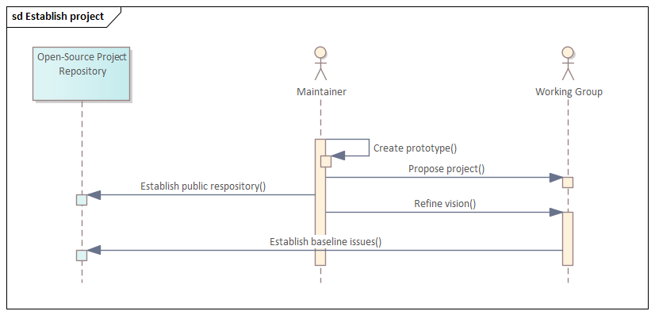
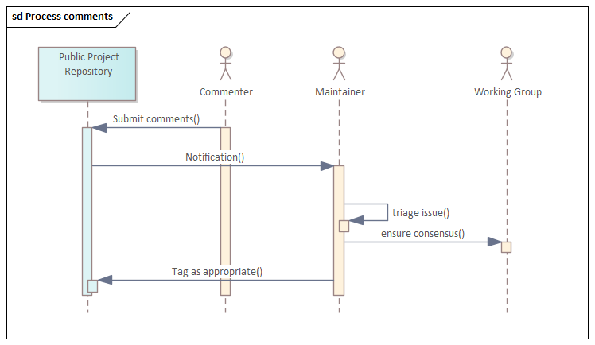
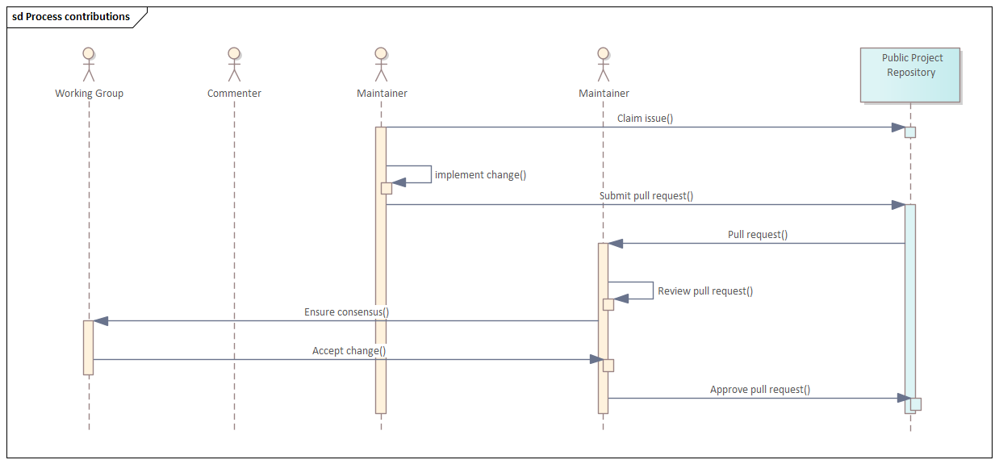
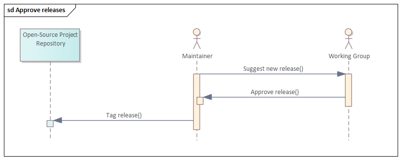

<!-- markdownlint-enable require-heading-body -->

# Overview {.body}

Managing an open-source project involves four major activities as described in
the following clauses:

1. Establishing the project
2. Processing comments
3. Processing contributions
4. Approving releases

## Establishing the Project {.body}

Figure 1 provides an overview of the process to establish a new open-source project.

When someone identifies a need for a new shared resource (e.g., industry
standard, reusable code, etc.) within ITS, they can develop a proposal and
submit it to an appropriate standards working group (WG) or committee. The
proposal can be relatively simple (e.g., a statement of goals and structure) or
a complete prototype.

If the proposal is accepted by the WG, the WG will assign one or more
maintainers who will become responsible for leading the project. This will often
include the individual proposing the project. The maintainer will establish the
open-source project repository on the standards development organization's
open-source website (e.g., GitHub account) and upload the initial project files.

Once the initial upload is provided, the maintainer will work with the working
group to refine the vision for the project and establish the set of baseline
issues as a part of the project plan. The project plan will also define the
planned release schedule, which can be based on a calendar schedule, reaching
milestones, or achieving other metrics. Members of the WG are encouraged to
submit their issues directly so that the originator can be properly captured and
to encourage WG members to become familiar with the process; however, the
Maintainer can submit comments on the behalf of others, if needed.

## Process comments {.body}

Figure 2 provides an overview of how comments are processed for an open-source
project.

Users of open-source projects often have questions, encounter bugs, request
features, or provide feedback on usability. Submitting comments is the primary
way for the community to help guide the development of the project. Comments can
be submitted at any time.

When comments are submitted, maintainers (and other followers) are notified. If
the comment is submitted as an issue (as opposed to a discussion item), the
maintainer triages the issue by determing its relevance, classification (e.g.,
bug, documentation issue), and priority. If needed, the maintainer can discuss
the issue with the commentor or sponsoring WG to ensure consensus from the
broader community. As a result of the review, the issue can be accepted, merged
with another issue, split into multiple issues, or rejected (e.g., if it does
not fit with the project's goals). Once the triage is complete, the maintainer
adds tags as appropriate to the issue so that it can properly be managed.

## Procss Contributions {.body}

Figure 3 provides an overview of processing contributions to an open-source project.

Open-source projects encourage contributions from the community, allowing others
to solve issues or implement features. Contributors gain experience and
recognition, while the project benefits from a broader range of solutions.

Interested contributors browse the list of open issues, claim one they are
interested in, and start working on a solution. When they have develped and
tested their proposed solution, they submit a request for the maintainer to
"pull" a copy of their changes from their site. This is known as a pull request
(PR).

When a PR is submitted, the maintainer is automatically notified and is
responsible for reviewing the request to ensure that it:

- can be safely merged with the project without overwriting other changes,
- solves the stated problem without introducing bugs, and
- meets the project's guidelines (e.g., coding standards).

During the review process, the maintainer can communicate with the contributor
if questions arise or with the WG to ensure consensus on the details of the
proposed change. If the process identifies any issues with the proposed change,
it can be returned to the contributor to make additional revisions. Once the
changes are deemed to be satisfactory, the maintainer can accept the pull
request and the changes will be merged into the open-source project.

## Approve Releases {.body}

Figure 4 provides an overview of the process to approve a new release of an
open-source project.

Releasing a project allows users to access a stable, tested version with new
features, bug fixes, or improvements. It also provides a versioned snapshot that
is easier to manage and distribute.

Once all expected changes have been made to fulfil a defined stage in the
project plan, the maintainer will follow the project's defined process for
obtaining approval of the current draft as a formal release (e.g., v01.01.03)
from the responsible WG. Depending on the type of project, this process might
consist of a simple notification to the WG or could entail a formal ballot of
the WG's parent SDO(s). For NTCIP-sponsored open-source projects, the process is
defined in NTCIP 8001.

Once approval has been received, the maintainer documents the changes through
release notes (if not already included), adds the release tag (e.g.,
"v01.01.03"), and provides a downloadable archive.

This collaborative process allows open-source projects to evolve through
contributions from users and developers worldwide, promoting continuous
improvement while ensuring transparency and accountability
